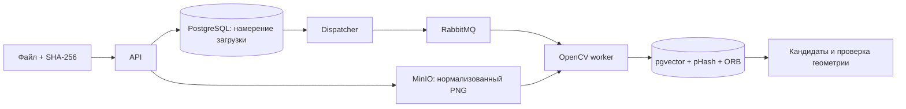

# 15. ImageTwin

**Поиск повторно загруженных изображений, включая сжатие, уменьшение,
обрезку и водяные знаки.** Проект уровня Middle+ Backend + Computer Vision.

FastAPI принимает изображения, MinIO хранит файлы, RabbitMQ передаёт задания,
а worker извлекает признаки через OpenCV. В PostgreSQL с pgvector остаются
векторы, perceptual hash и локальные признаки для проверки совпадений.

## Что реализовано

- Закрытые коллекции изображений, JWT и проверка владельца.
- Загрузка PNG/JPEG с SHA-256, ограничениями размера и числа пикселей.
- Нормализация ориентации, удаление EXIF и дедупликация одинаковых пикселей.
- Повтор загрузки после ошибки S3 с тем же ключом идемпотентности.
- Фоновая индексация с lease и защитой от устаревшего worker.
- Поиск кандидатов по вектору и pHash внутри одной коллекции.
- Проверка совпадений через ORB и homography: одной похожести объектов недостаточно.
- Объяснение результата: расстояние hash, cosine similarity, число совпавших точек.
- Повторная индексация, удаление из поиска и очистка объекта в S3.
- Тесты, сценарий аварийного восстановления и измерение ошибок поиска.

## Запуск

```bash
cd ~/Desktop/Python-Backend-Portfolio/15-image-twin
docker compose up --build -d --wait --wait-timeout 180
docker compose exec -T api python scripts/smoke.py
```

Swagger: <http://localhost:8150/docs>.
Пользователь: `demo@example.com` / `ImageTwinDemo123!`.
Демо-коллекция: `15000000-0000-0000-0000-000000000010`.

Модель и тестовые снимки уже включены в репозиторий; ключи сторонних сервисов
не требуются. Снаружи доступен только порт API на 127.0.0.1.

## Как пользоваться API

1. Получить Bearer token через `POST /auth/login`.
2. Создать коллекцию через `POST /collections`, например `{"name":"Product photos"}`.
3. Загрузить файл через `PUT /collections/{id}/images`: тело — сам файл,
   заголовки — `Idempotency-Key` и `X-Content-SHA256`.
4. Дождаться `ready` в `GET /images/{id}`.
5. Открыть `GET /images/{id}/duplicates`. Результат содержит ID совпадений
   и признаки, на основании которых они признаны копиями.
6. Снимок доступен по `/images/{id}/content` с авторизацией. История — `/events`.

Одинаковые пиксели возвращают тот же image ID. Изменённая копия получает свой
ID и может быть найдена через duplicates. Поиск не объединяет записи в
транзитивные группы и не удаляет совпадения автоматически.

## Как определяется копия

Сначала сравниваются pHash и векторы из слоя global average pooling
готового MobileNetV2. Затем ORB сопоставляет локальные точки, а RANSAC
проверяет, согласуются ли они с одним геометрическим преобразованием.

Копией считается пара с близким hash и вектором либо с достаточным числом
геометрически согласованных точек. Равномерно окрашенные изображения не
принимаются только по hash: для них такой признак слишком неоднозначен.

Энкодер **готовый, из ONNX Model Zoo**, обучен на ImageNet. Здесь реализовано
его подключение к сервису и проверка дубликатов; собственное обучение
визуальной нейросети не заявляется.

## Проверка качества

В репозитории 8 открытых снимков с указанными авторами. Для каждого созданы
JPEG quality=45, уменьшенная версия, обрезка по 12% с каждой стороны
и версия с водяным знаком. Исходники разделены на две группы по 4 снимка.
Пороги зафиксированы в коде до оценки второй группы.

| Проверка на второй группе | Только pHash | Комбинация признаков |
|---|---:|---:|
| Найденные копии | 10 из 16 | 16 из 16 |
| Пропущенные копии | 6 | 0 |
| Ложные совпадения | 0 из 48 отрицательных пар | 0 из 48 отрицательных пар |

Первая группа дала 12 из 16 найденных копий для комбинированного метода.
На маленьких и малодетальных изображениях обрезка остаётся трудным случаем.
Этот небольшой набор проверяет конкретные преобразования и не доказывает
качество на всём каталоге маркетплейса.

Отчёт: [docs/evaluation.json](docs/evaluation.json).
Повторить: `uv run python scripts/evaluate.py`.

## Тесты и сбои

```bash
make check
make test
make smoke
uv run python scripts/recovery_smoke.py
```

Recovery script запускается с хоста. Он временно останавливает MinIO,
повторяет неудавшуюся загрузку, затем завершает worker через SIGKILL.
После восстановления проверяется одна запись индекса при двух попытках.
Скрипт перезапускает только сервисы этого проекта.



[Архитектура](docs/architecture.md) · [Эксплуатация](docs/runbook.md) ·
[Проверки](docs/verification.md) · [Для интервью](docs/interview.md) ·
[Источники изображений](data/README.md) · [Энкодер](models/README.md).
